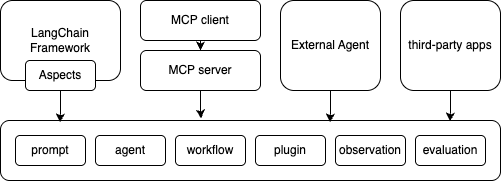

# 关于 HiAgent-SDK

[English](README.md) | 中文README

HiAgent-Java-SDK是火山引擎的HiAgent产品的Java SDK，开发者可使用该SDK，快捷的开发功能，提升开发效率。HiAgent-Java-SDK提供了完整的AI原生应用开发套件，包括丰富的开发组件和应用示例代码。

## productCode

SDK 支持通过客户端配置传入可选的 `productCode`。请求会携带 Header `X-Trace-Product-Code`；未配置或配置为空白时不会携带该 Header。请求级显式 Header 优先于客户端默认值。

```java
ChatClient chat = new ChatClient(endpoint, apiKey, "your-product-code");
ApiClient top = new ApiClient(endpoint, ak, sk, "cn-north-1", "your-product-code");
HibotConfig hibot = HibotConfig.builder()
    .endpoint(endpoint).accessKey(ak).secretKey(sk).workspaceId(workspaceId)
    .productCode("your-product-code").build();
Client observe = new Client(traceEndpoint, topEndpoint, ak, sk, workspaceId, appId,
    "your-product-code");
```

Observe 的 `productCode` 只加入 OTLP trace 导出请求，`CreateApiToken` 的请求体保持原协议。

## 架构



## 使用文档

访问[文档地址](https://bytedance.larkoffice.com/docx/N0nJdJgHhoKY0TxBKE9c88hSncg) 获取文档说明

## 快速开始

```java
// 初始化
// TODO
```


## 安全
如果您发现本项目中的潜在安全风险，请通过我们的 [安全中心](https://security.bytedance.com/src) or [漏洞报告邮箱](sec@bytedance.com)联系我们.

## License

该项目采用 [Apache-2.0 License](LICENSE) 许可。
